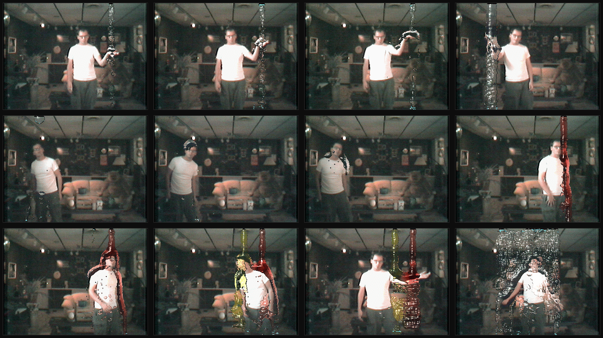

# waterworks

vintage software - source code for the waterworks from 2001.

a long time ago i taught a graphics lab course at washington university,
built around student-chosen final projects. two of them caught my eye: one
student rendered convincing water droplets, another simulated drifting sand.
neither was water - but i could see that, fused, they'd make flowing,
interactive water.

so i built that: a life-size virtual shower you could step into, see yourself
projected on a screen, and play with water that flowed around you - catch it,
push it, pass it to the person beside you. it ran in realtime on a single PIII
in 1999-2001, before programmable GPUs - all the simulation and rendering on
the CPU. a camera (via video4linux2) found your silhouette; a particle
simulation flowed the water around you; a renderer shaded the droplets and
projected them back.

"the waterworks" showed in the emerging technologies exhibition at SIGGRAPH
2001. today i release the code into the public domain, in the hopes that it
might be of historic interest to someone.

## links

- [SIGGRAPH 2001 emerging technologies — the waterworks](http://web.archive.org/web/20150919174444/http://www.siggraph.org/s2001/conference/etech/waterworks.html) (a chair's prerogative exhibit)
- [original release on sourceforge](http://waterworks.sourceforge.net)
- [original project page, archived](http://web.archive.org/web/20241014081057/https://www.qarl.com/menu/waterworks/)
